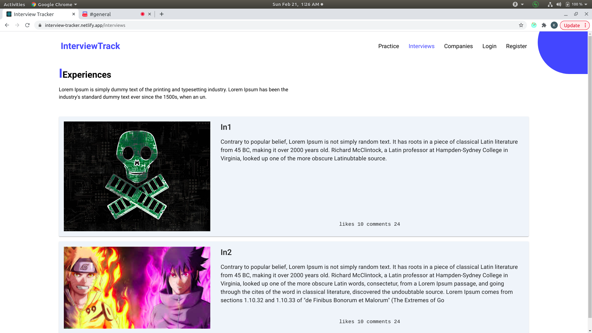

# Interview Tracker
   Interview is a website aimed to help students,in preparing for the placements interview,by tracking the questions solved and providing interview experiencs of students from various backgrounds .
   Figma link is [here](https://www.figma.com/file/bFVlBKuPZcWQzalhE24i56/Untitled?node-id=0%3A3)
   Project is at [here](https://interview-tracker.netlify.app/)


## Tech Stack
  Teach stack used to create build the project 

  ### Frontend
   - React
   - Materail ui 
   - Netlify
   - React-draft editor

  ### Backend
   - Node,Express
   - Mongodb
   - Passport for socail auth
   - azure as data storge
   - heroku to deploy

## Features 
   - Solve questions based on topics
   - Read inteviews from various users
   - Social auth,github,google,outlook
   - Add questions
   - Interviews based on companies
   - Add comments on interviews and star them
   - Add questions and interviews to starred
   - Create interview in an rich text editor
   - See starred questions,interviews and my quetions at ur dashboard


## Dev Setup

Now there are a lot of env variables to setup here to bear with me 
- Backend
```
#Go through the .env.example try to add

npm install
npm run dev
```
- Frontend
```
npm install 
npm start
```


### ScreenShots
#### Home page


Questions Flow


Interviews Flow




Profile FLow


